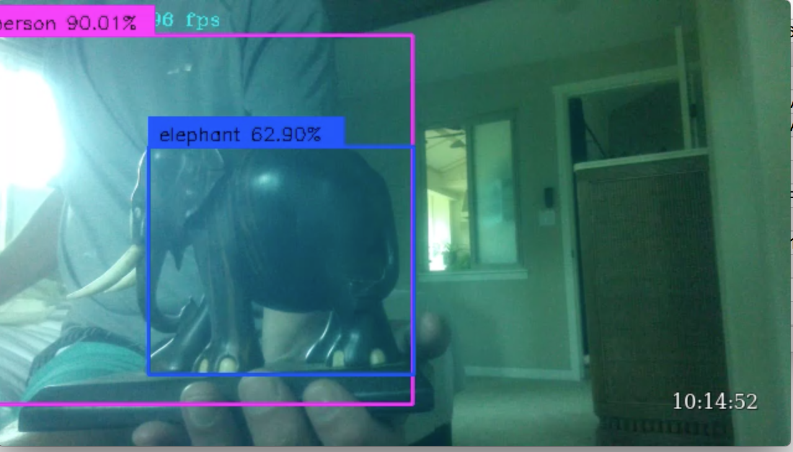
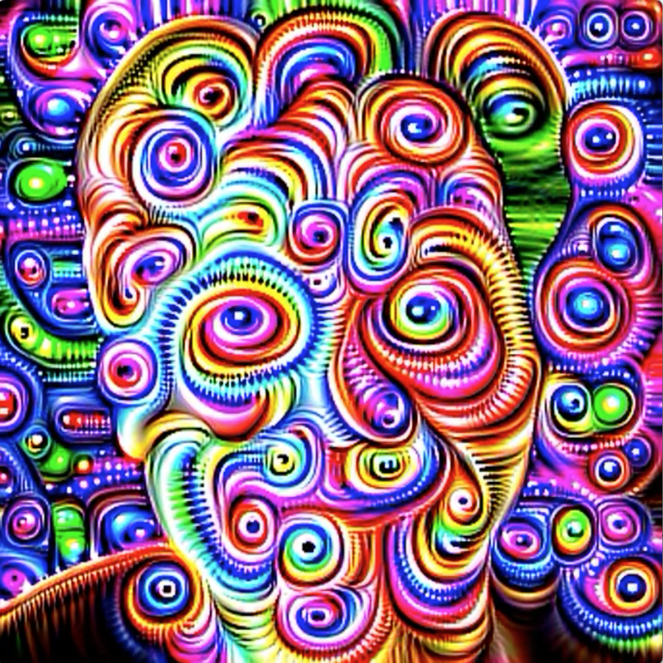

# tx2yolovideo

This project contains various attempts at grabbing video from the onboard Jetson TX2 camera. Particularly interesting is yolo.c which is a gstreamer pipeline that use yolo V3 to detect and put bounding boxes around objects.

Briefly:

* yolo.c: Darknet V3 gstreamer pipeline, that also will save stream as mp4, needs libgstyolo.so (in the .tgz) and libdarknet.so (which you will have to download and install from link below).
* yolopipeline.sh: The slow gst-launch-1.0 version of the pipeline above.
* yolo_objection_detection.cpp: darknet V2 C++ version.
* tx2video.cpp: does some cute fancy image transforms.

The yolo.c app is the most developed. It interleaves annotations which run at about 3FPS with the video stream. Here is a screen shot:

Or try this, click to view movie...:

<table style="width:240px">
    <tr>
        <th>A Rough Night - Click to view movie...</th>
    </tr>
    <tr>
        <td>
            
        </td>
    </tr>
</table>

Super thanks to Joseph Redmon for darknet: https://pjreddie.com/darknet/yolo/

_YOLOv3: An Incremental Improvement

    Redmon, Joseph and Farhadi, 
    
    AliarXiv,
    
  2018

